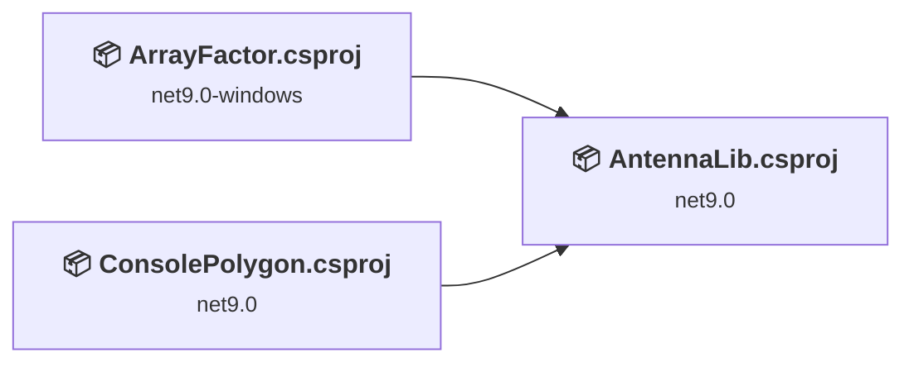
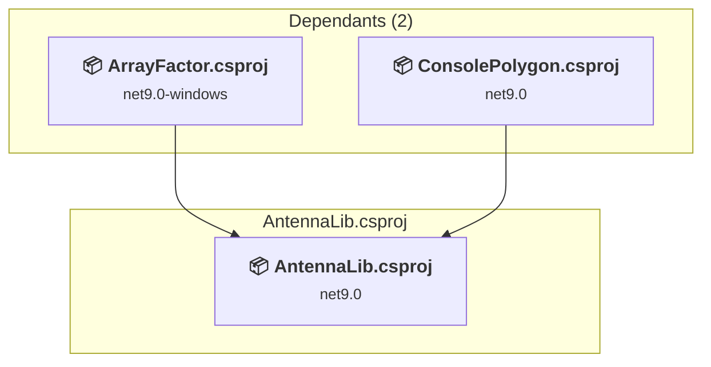
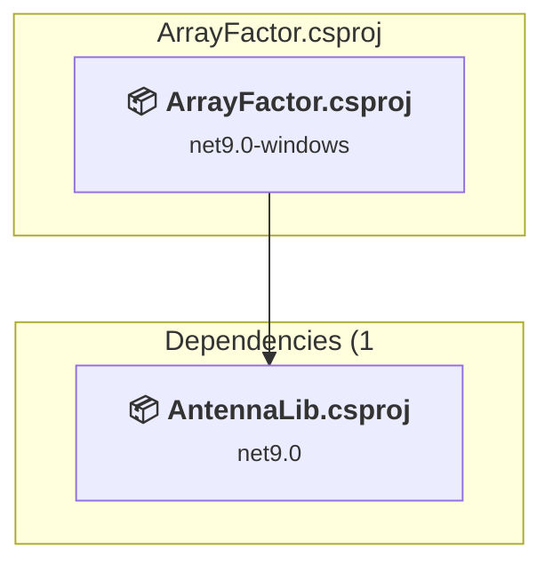
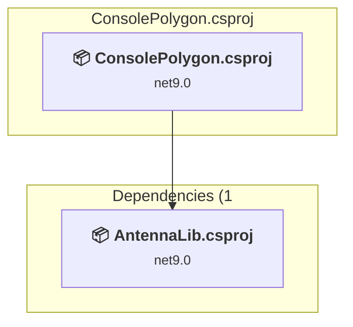

# Projects and dependencies analysis

This document provides a comprehensive overview of the projects and their dependencies in the context of upgrading to .NETCoreApp,Version=v10.0.

## Table of Contents

- [Executive Summary](#executive-Summary)
  - [Highlevel Metrics](#highlevel-metrics)
  - [Projects Compatibility](#projects-compatibility)
  - [Package Compatibility](#package-compatibility)
  - [API Compatibility](#api-compatibility)
- [Aggregate NuGet packages details](#aggregate-nuget-packages-details)
- [Top API Migration Challenges](#top-api-migration-challenges)
  - [Technologies and Features](#technologies-and-features)
  - [Most Frequent API Issues](#most-frequent-api-issues)
- [Projects Relationship Graph](#projects-relationship-graph)
- [Project Details](#project-details)

  - [AntennaLib\AntennaLib.csproj](#antennalibantennalibcsproj)
  - [ArrayFactor\ArrayFactor.csproj](#arrayfactorarrayfactorcsproj)
  - [Tests\ConsolePolygon\ConsolePolygon.csproj](#testsconsolepolygonconsolepolygoncsproj)

## Executive Summary

### Highlevel Metrics

| Metric | Count | Status |
| :--- | :---: | :--- |
| Total Projects | 3 | All require upgrade |
| Total NuGet Packages | 4 | 1 need upgrade |
| Total Code Files | 52 |  |
| Total Code Files with Incidents | 29 |  |
| Total Lines of Code | 4036 |  |
| Total Number of Issues | 222 |  |
| Estimated LOC to modify | 218+ | at least 5,4% of codebase |

### Projects Compatibility

| Project | Target Framework | Difficulty | Package Issues | API Issues | Est. LOC Impact | Description |
| :--- | :---: | :---: | :---: | :---: | :---: | :--- |
| [AntennaLib\AntennaLib.csproj](#antennalibantennalibcsproj) | net9.0 | 🟢 Low | 0 | 0 |  | ClassLibrary, Sdk Style = True |
| [ArrayFactor\ArrayFactor.csproj](#arrayfactorarrayfactorcsproj) | net9.0-windows | 🟡 Medium | 1 | 216 | 216+ | Wpf, Sdk Style = True |
| [Tests\ConsolePolygon\ConsolePolygon.csproj](#testsconsolepolygonconsolepolygoncsproj) | net9.0 | 🟢 Low | 0 | 2 | 2+ | DotNetCoreApp, Sdk Style = True |

### Package Compatibility

| Status | Count | Percentage |
| :--- | :---: | :---: |
| ✅ Compatible | 3 | 75,0% |
| ⚠️ Incompatible | 1 | 25,0% |
| 🔄 Upgrade Recommended | 0 | 0,0% |
| ***Total NuGet Packages*** | ***4*** | ***100%*** |

### API Compatibility

| Category | Count | Impact |
| :--- | :---: | :--- |
| 🔴 Binary Incompatible | 201 | High - Require code changes |
| 🟡 Source Incompatible | 4 | Medium - Needs re-compilation and potential conflicting API error fixing |
| 🔵 Behavioral change | 13 | Low - Behavioral changes that may require testing at runtime |
| ✅ Compatible | 4795 |  |
| ***Total APIs Analyzed*** | ***5013*** |  |

## Aggregate NuGet packages details

| Package | Current Version | Suggested Version | Projects | Description |
| :--- | :---: | :---: | :--- | :--- |
| MathCore | 0.0.93.2 |  | [AntennaLib.csproj](#antennalibantennalibcsproj) [ArrayFactor.csproj](#arrayfactorarrayfactorcsproj) [ConsolePolygon.csproj](#testsconsolepolygonconsolepolygoncsproj) | ✅Compatible |
| MathCore.WPF | 0.0.48.2 |  | [ArrayFactor.csproj](#arrayfactorarrayfactorcsproj) | ✅Compatible |
| OxyPlot.Contrib.Wpf | 2.1.2 |  | [ArrayFactor.csproj](#arrayfactorarrayfactorcsproj) | ✅Compatible |
| OxyPlot.Wpf | 2.2.0 | 2.1.2 | [ArrayFactor.csproj](#arrayfactorarrayfactorcsproj) | ⚠️Пакет NuGet несовместим |

## Top API Migration Challenges

### Technologies and Features

| Technology | Issues | Percentage | Migration Path |
| :--- | :---: | :---: | :--- |
| WPF (Windows Presentation Foundation) | 140 | 64,2% | WPF APIs for building Windows desktop applications with XAML-based UI that are available in .NET on Windows. WPF provides rich desktop UI capabilities with data binding and styling. Enable Windows Desktop support: Option 1 (Recommended): Target net9.0-windows; Option 2: Add <UseWindowsDesktop>true</UseWindowsDesktop>. |

### Most Frequent API Issues

| API | Count | Percentage | Category |
| :--- | :---: | :---: | :--- |
| M:System.Windows.Markup.MarkupExtension.#ctor | 15 | 6,9% | Binary Incompatible |
| M:System.Windows.Markup.DependsOnAttribute.#ctor(System.String) | 12 | 5,5% | Binary Incompatible |
| T:System.Windows.Markup.DependsOnAttribute | 12 | 5,5% | Binary Incompatible |
| T:System.Windows.Markup.MarkupExtension | 10 | 4,6% | Binary Incompatible |
| M:System.Windows.Data.ValueConversionAttribute.#ctor(System.Type,System.Type) | 8 | 3,7% | Binary Incompatible |
| T:System.Windows.Data.ValueConversionAttribute | 8 | 3,7% | Binary Incompatible |
| T:System.Uri | 7 | 3,2% | Behavioral Change |
| T:System.Windows.Data.IValueConverter | 7 | 3,2% | Binary Incompatible |
| T:System.Windows.Application | 6 | 2,8% | Binary Incompatible |
| M:System.Uri.#ctor(System.String,System.UriKind) | 6 | 2,8% | Behavioral Change |
| T:System.Windows.DependencyProperty | 6 | 2,8% | Binary Incompatible |
| M:System.Windows.Application.LoadComponent(System.Object,System.Uri) | 5 | 2,3% | Binary Incompatible |
| T:System.Windows.Media.Geometry | 5 | 2,3% | Binary Incompatible |
| T:System.Windows.Controls.ItemsControl | 4 | 1,8% | Binary Incompatible |
| T:System.Windows.Shapes.Line | 4 | 1,8% | Binary Incompatible |
| T:System.Windows.Markup.IComponentConnector | 4 | 1,8% | Binary Incompatible |
| T:System.Windows.Point | 4 | 1,8% | Binary Incompatible |
| P:System.Windows.Shapes.Shape.StrokeThickness | 4 | 1,8% | Binary Incompatible |
| T:System.Windows.Size | 4 | 1,8% | Binary Incompatible |
| M:System.Windows.Window.#ctor | 4 | 1,8% | Binary Incompatible |
| P:System.Windows.UIElement.RenderSize | 3 | 1,4% | Binary Incompatible |
| T:System.Windows.Data.IMultiValueConverter | 3 | 1,4% | Binary Incompatible |
| P:System.Windows.Input.MouseWheelEventArgs.Delta | 3 | 1,4% | Binary Incompatible |
| M:System.Threading.Tasks.Task.WhenAll(System.ReadOnlySpan{System.Threading.Tasks.Task}) | 3 | 1,4% | Source Incompatible |
| T:System.Windows.Shapes.Ellipse | 2 | 0,9% | Binary Incompatible |
| T:System.Windows.Controls.Grid | 2 | 0,9% | Binary Incompatible |
| M:System.Windows.Controls.UserControl.#ctor | 2 | 0,9% | Binary Incompatible |
| P:System.Windows.Size.Height | 2 | 0,9% | Binary Incompatible |
| P:System.Windows.Size.Width | 2 | 0,9% | Binary Incompatible |
| T:System.Windows.Media.SweepDirection | 2 | 0,9% | Binary Incompatible |
| M:System.Windows.DependencyObject.SetValue(System.Windows.DependencyProperty,System.Object) | 2 | 0,9% | Binary Incompatible |
| M:System.Windows.DependencyObject.GetValue(System.Windows.DependencyProperty) | 2 | 0,9% | Binary Incompatible |
| M:System.Windows.Markup.MarkupExtensionReturnTypeAttribute.#ctor(System.Type) | 2 | 0,9% | Binary Incompatible |
| T:System.Windows.Markup.MarkupExtensionReturnTypeAttribute | 2 | 0,9% | Binary Incompatible |
| T:System.Windows.Window | 2 | 0,9% | Binary Incompatible |
| T:System.Windows.RoutedEvent | 2 | 0,9% | Binary Incompatible |
| T:System.Windows.Input.MouseWheelEventArgs | 2 | 0,9% | Binary Incompatible |
| P:System.Windows.RoutedEventArgs.Handled | 2 | 0,9% | Binary Incompatible |
| P:System.Windows.Controls.TextBox.Text | 2 | 0,9% | Binary Incompatible |
| M:System.Windows.Markup.InternalTypeHelper.#ctor | 1 | 0,5% | Binary Incompatible |
| T:System.Windows.Markup.InternalTypeHelper | 1 | 0,5% | Binary Incompatible |
| T:System.Windows.Controls.UserControl | 1 | 0,5% | Binary Incompatible |
| M:System.Windows.Point.#ctor(System.Double,System.Double) | 1 | 0,5% | Binary Incompatible |
| T:System.Windows.Media.TranslateTransform | 1 | 0,5% | Binary Incompatible |
| M:System.Windows.Media.TranslateTransform.#ctor(System.Double,System.Double) | 1 | 0,5% | Binary Incompatible |
| T:System.Windows.Media.Transform | 1 | 0,5% | Binary Incompatible |
| P:System.Windows.Media.Geometry.Transform | 1 | 0,5% | Binary Incompatible |
| F:System.Windows.Media.SweepDirection.Counterclockwise | 1 | 0,5% | Binary Incompatible |
| M:System.Windows.Media.StreamGeometryContext.ArcTo(System.Windows.Point,System.Windows.Size,System.Double,System.Boolean,System.Windows.Media.SweepDirection,System.Boolean,System.Boolean) | 1 | 0,5% | Binary Incompatible |
| M:System.Windows.Media.StreamGeometryContext.BeginFigure(System.Windows.Point,System.Boolean,System.Boolean) | 1 | 0,5% | Binary Incompatible |

## Projects Relationship Graph

Legend:
📦 SDK-style project
⚙️ Classic project

## Project Details

### AntennaLib\AntennaLib.csproj

#### Project Info

- **Current Target Framework:** net9.0
- **Proposed Target Framework:** net10.0
- **SDK-style**: True
- **Project Kind:** ClassLibrary
- **Dependencies**: 0
- **Dependants**: 2
- **Number of Files**: 17
- **Number of Files with Incidents**: 1
- **Lines of Code**: 1603
- **Estimated LOC to modify**: 0+ (at least 0,0% of the project)

#### Dependency Graph

Legend:
📦 SDK-style project
⚙️ Classic project

### API Compatibility

| Category | Count | Impact |
| :--- | :---: | :--- |
| 🔴 Binary Incompatible | 0 | High - Require code changes |
| 🟡 Source Incompatible | 0 | Medium - Needs re-compilation and potential conflicting API error fixing |
| 🔵 Behavioral change | 0 | Low - Behavioral changes that may require testing at runtime |
| ✅ Compatible | 2057 |  |
| ***Total APIs Analyzed*** | ***2057*** |  |

### ArrayFactor\ArrayFactor.csproj

#### Project Info

- **Current Target Framework:** net9.0-windows
- **Proposed Target Framework:** net10.0-windows
- **SDK-style**: True
- **Project Kind:** Wpf
- **Dependencies**: 1
- **Dependants**: 0
- **Number of Files**: 28
- **Number of Files with Incidents**: 26
- **Lines of Code**: 1365
- **Estimated LOC to modify**: 216+ (at least 15,8% of the project)

#### Dependency Graph

Legend:
📦 SDK-style project
⚙️ Classic project

### API Compatibility

| Category | Count | Impact |
| :--- | :---: | :--- |
| 🔴 Binary Incompatible | 201 | High - Require code changes |
| 🟡 Source Incompatible | 2 | Medium - Needs re-compilation and potential conflicting API error fixing |
| 🔵 Behavioral change | 13 | Low - Behavioral changes that may require testing at runtime |
| ✅ Compatible | 1757 |  |
| ***Total APIs Analyzed*** | ***1973*** |  |

#### Project Technologies and Features

| Technology | Issues | Percentage | Migration Path |
| :--- | :---: | :---: | :--- |
| WPF (Windows Presentation Foundation) | 140 | 64,8% | WPF APIs for building Windows desktop applications with XAML-based UI that are available in .NET on Windows. WPF provides rich desktop UI capabilities with data binding and styling. Enable Windows Desktop support: Option 1 (Recommended): Target net9.0-windows; Option 2: Add <UseWindowsDesktop>true</UseWindowsDesktop>. |

### Tests\ConsolePolygon\ConsolePolygon.csproj

#### Project Info

- **Current Target Framework:** net9.0
- **Proposed Target Framework:** net10.0
- **SDK-style**: True
- **Project Kind:** DotNetCoreApp
- **Dependencies**: 1
- **Dependants**: 0
- **Number of Files**: 8
- **Number of Files with Incidents**: 2
- **Lines of Code**: 1068
- **Estimated LOC to modify**: 2+ (at least 0,2% of the project)

#### Dependency Graph

Legend:
📦 SDK-style project
⚙️ Classic project

### API Compatibility

| Category | Count | Impact |
| :--- | :---: | :--- |
| 🔴 Binary Incompatible | 0 | High - Require code changes |
| 🟡 Source Incompatible | 2 | Medium - Needs re-compilation and potential conflicting API error fixing |
| 🔵 Behavioral change | 0 | Low - Behavioral changes that may require testing at runtime |
| ✅ Compatible | 981 |  |
| ***Total APIs Analyzed*** | ***983*** |  |

