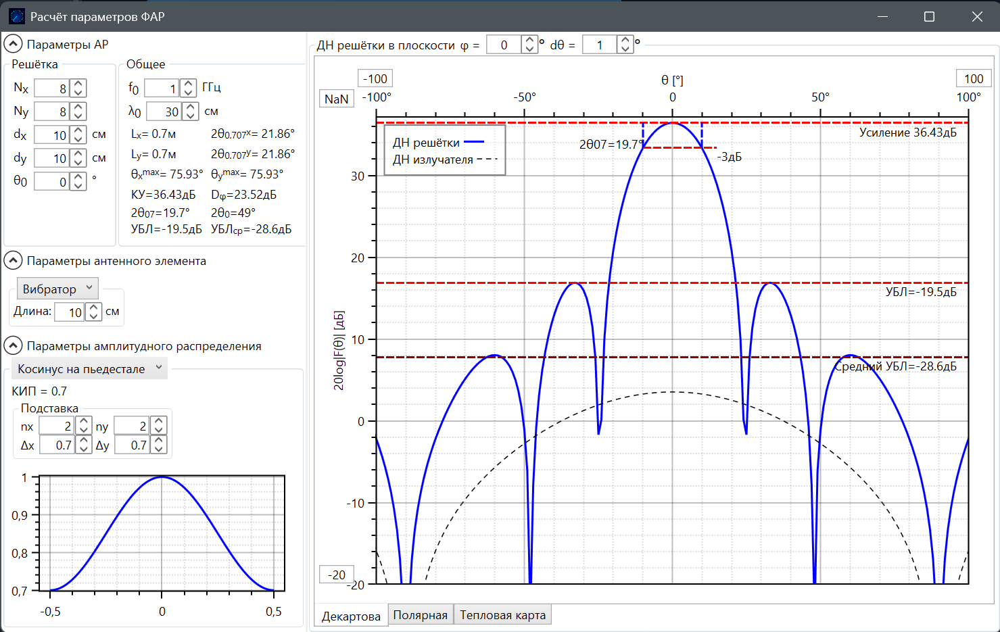
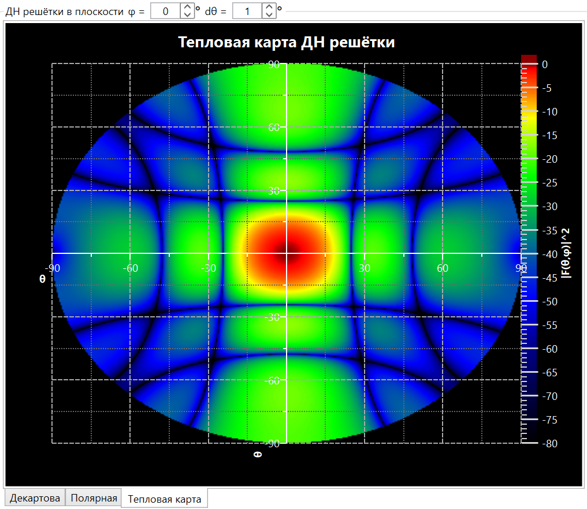

File: README.MD
````````
# AntennaLab

`AntennaLab` — репозиторий для расчёта и визуального анализа диаграмм направленности антенных решёток. Основу решения составляют два проекта:

- `AntennaLib` — библиотека моделей антенн, антенных элементов и решёток
- `ArrayFactor` — WPF-приложение для интерактивной настройки ФАР и визуализации результатов расчёта

Проект ориентирован на быстрый инженерный эксперимент: изменить геометрию решётки, выбрать тип элементарного излучателя и амплитудное распределение, после чего сразу увидеть сечения ДН, тепловую карту и производные параметры.

## Скриншоты

### Главное окно



### Тепловая карта ДН ФАР



## Что умеет `ArrayFactor`

`ArrayFactor` — настольное приложение под `net10.0-windows` с интерфейсом на WPF и графиками на `OxyPlot`.

Основные возможности:

- настройка прямоугольной антенной решётки: `Nx`, `Ny`, `dx`, `dy`
- задание рабочей частоты `f0` или длины волны `λ0`
- сканирование луча по углу `θ0`
- выбор элементарного излучателя:
  - всенаправленная антенна
  - вибратор
  - диполь
  - элемент Гюйгенса
- выбор амплитудного распределения апертуры:
  - равномерное
  - косинус на пьедестале
  - чебышевское
  - треугольное
- отображение результатов в нескольких представлениях:
  - декартово сечение ДН
  - полярное сечение ДН
  - тепловая карта пространственной ДН
- автоматический расчёт инженерных параметров:
  - усиление
  - ширина луча
  - уровень боковых лепестков
  - средний уровень боковых лепестков
  - предельный сектор сканирования
  - размеры апертуры

По коду `MainWindowModel` видно, что пересчёт запускается асинхронно при изменении параметров модели, а предыдущий расчёт отменяется через `CancellationTokenSource`. Это делает интерфейс отзывчивым при подборе параметров решётки.

## Что содержит `AntennaLib`

`AntennaLib` — вычислительное ядро решения под `net10.0`.

Ключевые сущности библиотеки:

- `IAntenna` — базовый контракт антенны с методом `Pattern`
- `Antenna` — абстрактная базовая реализация
- `AntennaItem` — антенный элемент с положением, ориентацией и комплексным коэффициентом возбуждения
- `AntennaArray` — общая модель антенной решётки
- `LinearAntennaArray` — линейная решётка
- `RectangularAntennaArray` — прямоугольная плоская решётка
- `UniformAntenna`, `Dipole`, `Vibrator`, `Guigens`, `LambdaAntenna` — готовые модели элементарных излучателей
- `BeamPatternExtensions` — вспомогательные методы для анализа ДН и вычисления направленности

По реализации библиотеки можно выделить несколько важных возможностей:

- построение решёток из одинаковых или произвольных антенных элементов
- учёт координат элемента, его ориентации и комплексного коэффициента возбуждения
- расчёт диаграммы направленности решётки как суммы вкладов всех элементов
- задание пользовательской диаграммы направленности через `LambdaAntenna`
- анализ рассчитанной ДН: поиск максимума, ширины луча, боковых лепестков и направленности

Таким образом, `ArrayFactor` использует `AntennaLib` как прикладное ядро, а сама библиотека может применяться отдельно в вычислительных сценариях и тестах.

## Архитектура репозитория

```text
AntennaLab/
├─ AntennaLib/                Вычислительная библиотека
├─ ArrayFactor/               WPF-приложение для расчёта и визуализации ФАР
├─ ArrayDesigner/             Дополнительный UI-проект репозитория
├─ Tests/                     Тестовые и вспомогательные проекты
└─ img/                       Изображения для документации
```

## Требования

- `.NET 10 SDK`
- Windows для запуска `ArrayFactor`, так как проект использует WPF
- Visual Studio 2026 или совместимая среда с поддержкой `.NET 10`

## Сборка и запуск

В корне репозитория:

```powershell
dotnet restore
dotnet build
```

Запуск приложения:

```powershell
dotnet run --project .\ArrayFactor\ArrayFactor.csproj
```

Запуск тестового проекта библиотеки:

```powershell
dotnet test .\Tests\AntennaLib.Tests\AntennaLib.Tests.csproj
```

## Типовой сценарий работы

1. Открыть `ArrayFactor`
2. Задать размеры решётки и шаг между элементами
3. Выбрать частоту или длину волны
4. Настроить тип элементарного излучателя
5. Выбрать амплитудное распределение апертуры
6. Просмотреть сечения ДН и тепловую карту
7. Оценить усиление, ширину луча и уровни боковых лепестков

## Особенности отладки

Во время отладки следует игнорировать `OperationCanceledException` (в обсуждениях может встречаться написание `OperationCancelledException`).

Сейчас это известное следствие архитектуры асинхронного пересчёта диаграммы направленности: при изменении параметров предыдущий расчёт отменяется, и исключение является частью штатного сценария отмены. В будущем это поведение планируется исправить архитектурно.

## Назначение репозитория

Репозиторий подходит для:

- учебного моделирования антенных решёток
- инженерной оценки влияния геометрии и распределения возбуждения на ДН
- прототипирования алгоритмов анализа ФАР
- дальнейшего развития вычислительного ядра и пользовательского интерфейса

````````

This is the description of what the code block changes:
Уточняю раздел про отладку, чтобы явно отразить пользовательскую формулировку и корректное имя исключения .NET.

This is the code block that represents the suggested code change:

````````
## Особенности отладки

Во время отладки следует игнорировать `OperationCanceledException` (в обсуждениях может встречаться написание `OperationCancelledException`).

Сейчас это известное следствие архитектуры асинхронного пересчёта диаграммы направленности: при изменении параметров предыдущий расчёт отменяется, и исключение является частью штатного сценария отмены. В будущем это поведение планируется исправить архитектурно.
